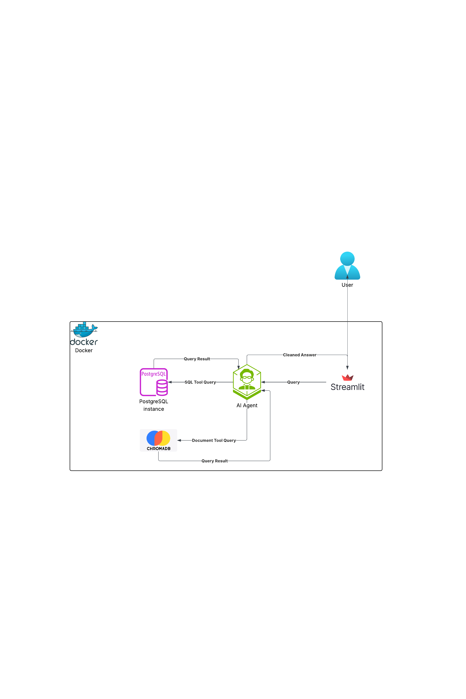

# Vehicle Assitant

## Table of Contents
- [Architecture](#architecture)
- [Installation](#installation)
- [Tradeoffs](#tradeoffs)

## Architecture
**Project Architecture**

## Installation
**To create this project locally** 

Firstly, ensure that you have docker and docker-compose installed.

1. Create your env file (hazel.env) using the example.env file as a template.

2. Ensure that the docker shell scripts are exacutable (example, simply run `chmod +x docker_build.sh` on Linux OS or Mac OS).

3. Build the images and run the containers by running the build shell script (like this: `./docker_build.sh`).

4. Run `./docker_destroy.sh` to delete all containers and images when done.

## Tradeoffs
**Project Trade-offs**

| Category | Advantages | Disadvantages |
|----------|------------|---------------|
| Latency  | The docker setup reduces the deployment and set up time | The added complexity with the function tools to pass different results to eith Postgres or Chromadb adds some latency |
| Cost | The use of open source tools reduces the cost of deployment and maintenance. Additionally, the decision to use the default embedding function for embedding the documents also saves some cost although it may mean the quality of the results retrieved might be a little lower.   The use of a cheaper model (gpt-4o-mini) reduces cost a bit but the impact might also be felt in the quality of the results |  |
| Security | Docker can provide some network isolation of the individual components against attacks. | The use of an agent as the central component leaves room to prompt injects that could go against the original instructions. |
| Maintainability | The use of docker and the isolation of various components makes it easy to maintain | Outside of the architecture, the `Assistants API` from OpenAI (which completely depreciates on August 26, 2026) was used.  **NB:** This can be easily swapped with the `Responses API` to keep this up-to-date. |

